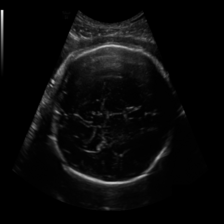
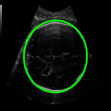

# Tensorflow2CPPExample

## Dependencies
1. [Tensorflow-2.9.1](https://github.com/tensorflow/tensorflow/archive/refs/tags/v2.9.1.tar.gz)
2. CUDA-11.7(Only for GPU version)
3. [cuDNN-8.4.1](https://developer.nvidia.com/rdp/cudnn-archive) (Only for GPU version)
4. Bazel-5.0.0 
5. Protobuf-3.9.2
7. OpenCV-4.2

## Build and install C++ library on Ubuntu20.04
### 1. Extract the Tensorflow source code
``` bash
tar -xzvf tensorflow-2.9.1.tar.gz
cd tensorflow-2.9.1
```

### 2. Configure and build
Check out [official configuration steps](https://www.tensorflow.org/install/source#optional_configure_the_build) for more details.

#### 2.1 CPU version
``` bash
# set nothing during configuration, all by default
./configure
# protobuf-3.9.2 can installed after tensorflow is configured and it's located in tensorflow-2.9.1/bazel-tensorflow-2.9.1/external/com_google_protobuf
# build the library
bazel build --config=opt --config=mkl --verbose_failures //tensorflow:libtensorflow_cc.so
# build the headers
bazel build --config=opt --config=mkl //tensorflow:install_headers
```

If it fails at compiling because of resources limit, we can build it again as below.
``` bash
bazel build --config=opt --jobs=10 --local_test_jobs=10 --local_cpu_resources=10 --local_ram_resources=1024 //tensorflow:libtensorflow_cc.so
```

If we want to specify optimization flags to use during compilation when bazel option "--config=opt" is specified, we can get them as below.
```bash
# get the CPU microarchitecture code
cat /sys/devices/cpu/caps/pmu_name
# i9-10900K
skylake
# get flags list on host machine(i9-10900K)
grep flags -m1 /proc/cpuinfo | cut -d ':' -f 2 | tr '[:upper:]' '[:lower:]' | { read FLAGS; OPT="-march=skylake"; for flag in $FLAGS; do case "$flag" in "sse4_1" | "sse4_2" | "ssse3" | "fma" | "cx16" | "popcnt" | "avx" | "avx2") OPT+=" -m$flag";; esac; done; MODOPT=${OPT//_/\.}; echo "$MODOPT"; }
-march=skylake -mssse3 -mfma -mcx16 -msse4.1 -msse4.2 -mpopcnt -mavx -mavx2
# add the list to the build parameter
bazel build --copt=-march=skylake --copt=-mssse3 --copt=-mfma --copt=-mcx16 --copt=-msse4.1 --copt=-msse4.2 --copt=-mpopcnt --copt=-mavx --copt=-mavx2 --copt=-mfpmath=both --config=mkl --verbose_failures //tensorflow:libtensorflow_cc.so
```

#### 2.2 GPU version
``` bash
# set cuda=y during configuration, the others by default
./configure
# build the library, build again by limiting resources when necessary
bazel build --config=opt --config=cuda --config=mkl --verbose_failures //tensorflow:libtensorflow_cc.so
# build the headers
bazel build --config=opt --config=cuda --config=mkl --verbose_failures //tensorflow:install_headers
```

### 3. Install the library
``` bash
# Collect headers
mkdir -p /path/to/install/tensorflow-headers
cd bazel-bin/tensorflow
cp -r include /path/to/install/tensorflow-headers
# Collect libraries
cp -P lib* /path/to/install/tensorflow-libraries
```

### 4. Verify the library
There are some examples in [tensorflow-2.9.1/tensorflow/examples](https://github.com/tensorflow/tensorflow/tree/master/tensorflow/examples) we can use to verify whether our build is successful.

## Code example
```bash
# compile
g++ -std=c++14 -I/path/to/install/tensorflow-headers -L/path/to/install/tensorflow-libraries  `pkg-config --cflags opencv4` src/get_prediction.cpp -ltensorflow_framework -ltensorflow_cc -lopencv_imgcodecs -lopencv_highgui -lopencv_imgproc -lopencv_core -o get_prediction
# predict
./get_prediction model_head data/hc_224_224.png data/output.png
```
     
### About the example
- The saved model was generated by my former colleague and was designed to assist clinical ultrasound analysis for fetal head.
- Use saved_model_cli to investigate the model's properties.

Some useful links
1. [tensorflow2_cpp](https://github.com/borarak/tensorflow2_cpp)
2. [build-tensorflow-from-source](https://gist.github.com/Brainiarc7/6d6c3f23ea057775b72c52817759b25c)
3. [Building Tensorflow from source. Step by step guide.](https://medium.com/analytics-vidhya/building-tensorflow-from-source-step-by-step-guide-1075ef2d9356)
